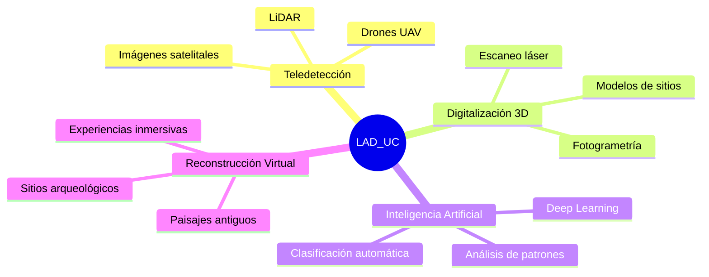

<!-- Animated Header usando readme-typing-svg -->

**Pontificia Universidad Católica de Chile · Escuela de Antropología**

<!-- Badges de identidad -->

<!-- Badges técnicos -->

---

[Sobre Nosotros](#-sobre-lad_uc) · [Investigación](#-líneas-de-investigación) · [Repositorios](#-repositorios) · [Servicios](#-servicios) · [Formación](#-formación) · [Colaborar](#-colaborar) · [Contacto](#-contacto)

---

## 🏛️ Sobre LAD_UC

El **Laboratorio de Arqueología Digital (LAD_UC)** es un espacio de investigación y desarrollo que integra tecnologías digitales en la práctica arqueológica. Opera bajo la Dirección de Estudios Aplicados de la Escuela de Antropología de la Pontificia Universidad Católica de Chile.

### Misión

Fortalecer la investigación arqueológica mediante la integración crítica de tecnologías digitales, impulsando el desarrollo de herramientas aplicadas y metodologías robustas para el estudio del registro arqueológico y el pasado humano.

### Visión

Consolidarse como referente latinoamericano en investigación, innovación metodológica y formación en arqueología digital, contribuyendo a las políticas de conservación y gestión del patrimonio cultural.

---

## 🔬 Líneas de Investigación

| Línea | Descripción | Tecnologías |
|-------|-------------|-------------|
| **🛰️ Teledetección Arqueológica** | Análisis de imágenes satelitales, de dron y datos LiDAR para detección y análisis de sitios | QGIS, Google Earth Engine, CloudCompare |
| **📐 Digitalización 3D** | Registro tridimensional de sitios y materiales arqueológicos mediante fotogrametría | Agisoft Metashape, Blender, MeshLab |
| **🤖 Inteligencia Artificial** | Aplicación de Deep Learning para análisis de patrones y clasificación arqueológica | Python, PyTorch, TensorFlow |
| **🏚️ Reconstrucción Virtual** | Modelamiento y visualización de sitios y paisajes antiguos | Unity, Unreal Engine, Blender |

---

## 📦 Repositorios

### Herramientas Principales

<table>
<tr>
<td width="50%">

### [colorchecker](https://github.com/Laboratorio-de-Arqueologia-Digital-UC/colorchecker)
Pipeline automatizado para corrección de color en fotografía arqueológica usando tarjetas de referencia ColorChecker.

</td>
<td width="50%">

### [backup-camera](https://github.com/Laboratorio-de-Arqueologia-Digital-UC/backup-camera)
Software para automatizar el respaldo de datos desde cámaras fotográficas y dispositivos de almacenamiento externo.

</td>
</tr>
</table>

### Próximamente

- 🔄 **Decorrelation-Blender**: Implementación Python de DStretch para análisis de arte rupestre
- 🗺️ **Least-Cost-Path**: Herramientas de análisis de rutas óptimas para estudios de movilidad
- 📊 **Archaeological-ML**: Modelos de clasificación para materiales arqueológicos

---

## 🛠️ Servicios

El laboratorio ofrece servicios especializados para proyectos de investigación, gestión patrimonial y estudios de impacto ambiental:

| Servicio | Descripción |
|----------|-------------|
| **Consultoría en arqueología digital** | Asesoría técnica para proyectos que requieran integración de tecnologías digitales |
| **Digitalización 3D** | Registro fotogramétrico de colecciones museológicas, sitios y materiales |
| **Análisis espacial y teledetección** | Procesamiento de imágenes satelitales y análisis SIG para estudios de impacto ambiental |
| **Contenidos digitales patrimoniales** | Desarrollo de experiencias virtuales, interactivas e inmersivas para difusión |

---

## 📚 Formación

### Programas Académicos

- **Pregrado**: Curso de Sistemas de Información Geográfica en Arqueología
- **Educación Continua**: Curso de Arqueología Digital
- **Investigación**: Dirección de proyectos de titulación en temáticas digitales

### Oportunidades

- 🎓 Pasantías para estudiantes de pregrado y postgrado
- 🔬 Prácticas profesionales en proyectos activos
- 📝 Proyectos de titulación con enfoque en arqueología digital

---

## 🤝 Colaborar

### Alianzas Institucionales

El laboratorio mantiene colaboraciones con:

- Servicio Nacional del Patrimonio Cultural
- Museos nacionales e internacionales
- Universidades con programas de arqueología
- Instituciones gubernamentales de patrimonio
- Comunidades locales y pueblos originarios

### Contribuir

Las contribuciones a los repositorios son bienvenidas. Para contribuir:

1. Revisar las guías de contribución de cada repositorio
2. Abrir un *issue* para discutir cambios propuestos
3. Enviar un *pull request* siguiendo las convenciones del proyecto

---

## 📬 Contacto

**Escuela de Antropología**  
Pontificia Universidad Católica de Chile  
Campus San Joaquín, Santiago, Chile

---

## 📄 Licencia

Los repositorios de LAD_UC utilizan licencias de código abierto. Consultar cada repositorio para información específica sobre licenciamiento.

---

**LAD_UC** · Laboratorio de Arqueología Digital  
Pontificia Universidad Católica de Chile

*Arqueología Digital desde Chile para el mundo* 🌎

